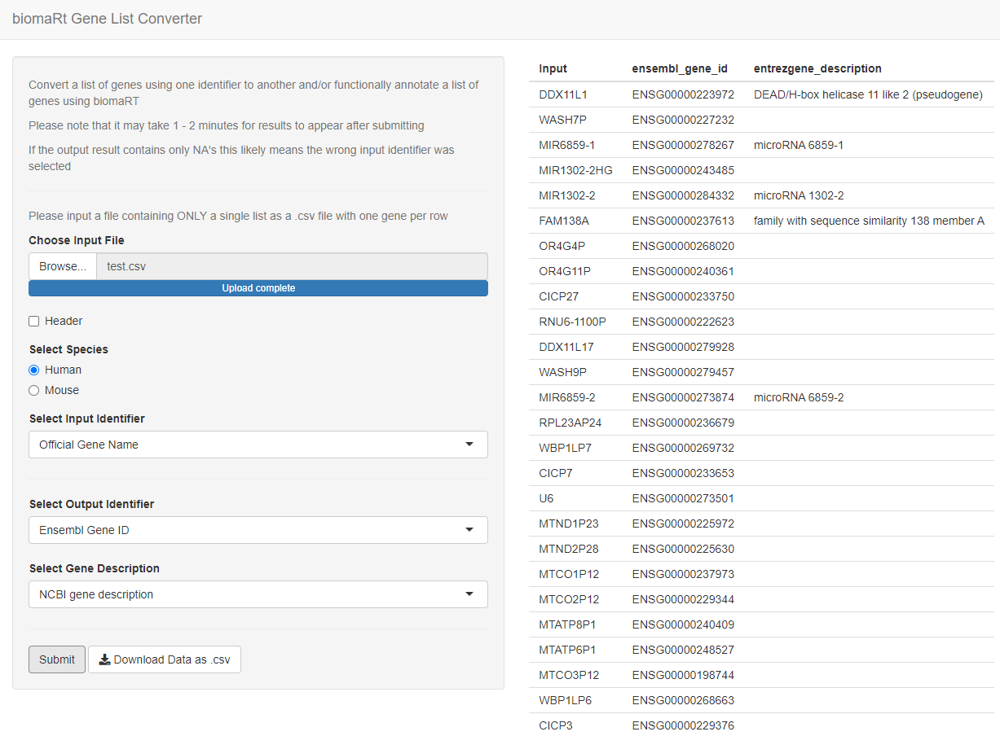

# biomaRt-genelist-converter
Convert a list of genes using one identifier to another and/or functionally annotate a list of genes using [biomaRt](https://bioconductor.org/packages/release/bioc/html/biomaRt.html)

### Access this tool

[Click this link](https://bobbyshih.shinyapps.io/Biomart_GeneNameConverter/)

Or copy and paste link into your web browser:

```
https://bobbyshih.shinyapps.io/Biomart_GeneNameConverter/
```

### How to use
* Upload your list of genes as a .csv file
* List of genes must be one entry per row. If it contains a header (for instance, the first entry is "Gene"), please check the "Header" box
* Select the gene identifier of the input gene list. This is typically "Official Gene Name", but may vary depending on output parameters specified in the pipeline used to generate the gene list. Note: If the incorrect input identifier is selected, the output table will only contain NA's
* Select desired output gene identifier and gene description
* Once all entries have been completed, hit submit. Note: Depending on size of the input, this may take 1 - 2 minutes
* The converted output may be downloaded as a .csv file
* The file test.csv is used to generate the preview images below. If you are having issues, please download this file as a reference

### Preview 

